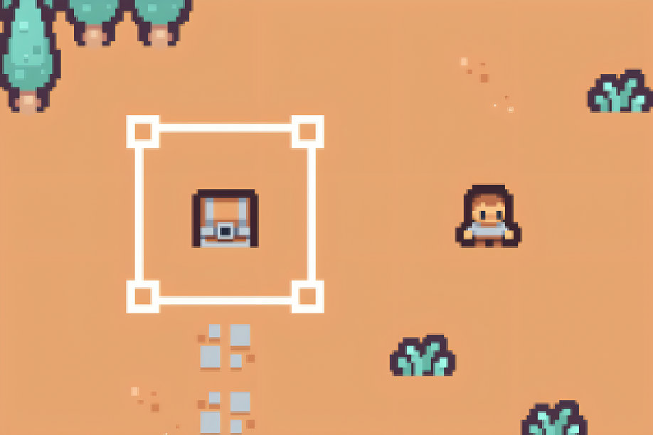

# Two Souls One Fate



Two Souls, One Fate is a story-driven 2D pixel RPG where every choice matters. Explore dangerous lands, fight powerful enemies, and decide who to save when fate forces you to choose between the people you love most.

Built with [Maki](https://www.npmjs.com/package/@tialops/maki) framework.

## Setup

```bash
npm install --global yarn
yarn
```

## Commands

- `yarn dev` — Start dev server
- `yarn tilemap` — Open tilemap editor